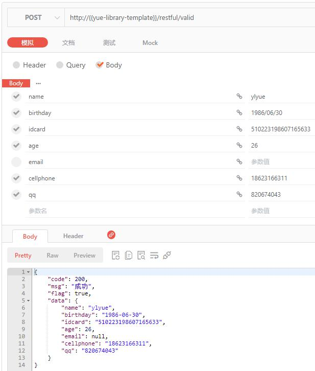

## RESTful <!-- {docsify-ignore} -->
RESTful是一种架构的规范与约束、原则，符合这种规范的架构就是RESTful架构，yue-library 已对RESTful风格的API进行了详细的阐述与定义。

### 统一响应体定义
响应体参数介绍：

|参数名称	|参数类型	|最大长度	|描述													|示例																	|
|--			|--			|--			|--														|--																		|
|`code`		|Int		|3			|响应状态码（参考HTTP状态码分组，但不做同步）				|200																	|
|`msg`		|String		|30			|响应提示（除状态码`>=600`外，此msg皆表示给开发者的提示）	|成功																	|
|`flag`		|Boolean	|			|响应状态												|true																	|
|`traceId`	|String		|			|链路追踪码												|1cc00a1d8be14acc98457b23b8f5ab9f										|
|`data`		|Object		|			|业务数据												|【钉钉】通知结果：{\"errcode\":0,\"success\":true,\"errmsg\":\"ok\"}		|

msg提示约定：
- 除状态码`>=600`外，此msg皆表示服务端给客户端（即开发者）的请求提示
- 一般情况其它错误提示，如：500，服务器内部错误等，需前端结合各自业务情况统一拦截处理，转换为优化的用户提示，如：`网络开小差了，请稍后重试...`
- 优好的用户提示，甚至可到页面步骤级别，不同步骤错误基于不同的友好提示。

响应示例：
```json
{
    "code": 200,
    "msg": "成功",
    "flag": true,
    "traceId": "1cc00a1d8be14acc98457b23b8f5ab9f",
    "data": "【钉钉】通知结果：{\"errcode\":0,\"success\":true,\"errmsg\":\"ok\"}"
}
```

### RESTful风格与Result实现
- `ai.yue.library.base.view.Result`
  - HTTP请求最外层响应对象：`code`、`msg`、`flag`、`traceId`、`data`
  - 内置结果转换与异常校验等
- `ai.yue.library.base.view.ResultEnum`
  - 定义了默认的`code`与`msg`，支持I18N
- `ai.yue.library.base.view.ResultCode`
  - 使用枚举实现此接口，可自定义`code`与`msg`值，参考：`ResultEnum`
  - `R.errorPromptI18n(ResultCode resultCode)`可返回自定义`code`与`msg`
- `ai.yue.library.base.view.R` 
  - 工具类，可便捷返回`Result`对象
  - 内置基本的响应：成功、失败、限流等
  - `R.errorPromptI18n(ResultCode resultCode)`可返回自定义`code`与`msg`

#### Result使用示例
**Controller定义：**
```java
@PostMapping("/valid")
public Result<?> valid(@Valid ValidationIPO validationIPO) {
	return R.success(validationIPO);
}
```

**响应结果如下图所示**：多了一层最外层响应对象



### API接口版本控制
　　在前后端分离、RESTful 接口盛行的当下，接口的版本控制是一个成熟的系统所应该拥有的。web模块提供的版本控制，可以方便我们快速构建一个基于版本的api接口。<br>
　　通过 `@ApiVersion` 注解可优雅的实现接口版本控制，注解定义如下：
```java
@Retention(RetentionPolicy.RUNTIME)
@Target({ ElementType.TYPE, ElementType.METHOD })
public @interface ApiVersion {

	/**
	 * RESTful API接口版本号
	 * <p>最近优先原则：在方法上的 {@link ApiVersion} 可覆盖在类上面的 {@link ApiVersion}，如下：
	 * <p>类上面的 {@link #value()} 值 = 1.1，
	 * <p>方法上面的 {@link #value()} 值 = 2.1，
	 * <p>最终效果：v2.1
	 */
	double value() default 1;
	
	/**
	 * 是否废弃版本接口
	 * <p>客户端请求废弃版本接口时将抛出错误提示：
	 * <p>当前版本已停用，请升级到最新版本
	 */
	boolean deprecated() default false;
	
}
```

#### 快速开始 @ApiVersion 注解的使用
　　版本控制默认为开启状态。可以通过 `yue.api-version.enabled=fasle` 关闭。
```java
@ApiVersion(2)
@RestController
@RequestMapping("/{version}/apiVersion")
public class ApiVersionConroller {
// 配合RESTful接口规约
// @RequestMapping("/open/{version}/apiVersion")
// public class OpenApiVersionConroller {
// @RequestMapping("/auth/{version}/apiVersion")
// public class AuthApiVersionConroller {

	/**
	 * get
	 * <p>弃用API接口版本演示
	 * 
	 * @param version
	 * @return
	 */
	@ApiVersion(deprecated = true)
	@GetMapping("/get")
	public Result<?> get(@PathVariable String version) {
		return R.success("get：" + version);
	}
	
	/**
	 * get2
	 * 
	 * @param version
	 * @return
	 */
	@ApiVersion(value = 2, deprecated = true)
	@GetMapping("/get")
	public Result<?> get2(@PathVariable String version) {
		return R.success("get2：" + version);
	}
	
	/**
	 * get3
	 * 
	 * @param version
	 * @return
	 */
	@ApiVersion(3.1)
	@GetMapping("/get")
	public Result<?> get3(@PathVariable String version) {
		return R.success("get3：" + version);
	}
	
	/**
	 * get4
	 * 
	 * @param version
	 * @return
	 */
	@ApiVersion(4)
	@GetMapping("/get")
	public Result<?> get4(@PathVariable String version) {
		return R.success("get4：" + version);
	}
	
}
```

注解优先级：方法上的 `@ApiVersion` > 类上面的 `@ApiVersion`

##### /v2/apiVersion/get
```json
{
    "code": 410,
    "msg": "当前API接口版本已弃用，请客户端更新接口调用方式",
    "flag": false,
    "data": null
}
```

##### /v3.1/apiVersion/get
```json
{
    "code": 200,
    "msg": "成功",
    "flag": true,
    "data": "get3：v3.1"
}
```

##### /v4/apiVersion/get
```json
{
    "code": 200,
    "msg": "成功",
    "flag": true,
    "data": "get4：v4"
}
```

#### API接口版本废弃
　　除了上面所演示的 `@ApiVersion(deprecated=true)` 通过注解来废弃版本之外，我们还提供了最小支持版本统一废弃处理。<br>
　　您可以使用 `yue.api-version.minimum-version` 配置来设置当前系统中允许的最小版本，以此废弃该版本之前的所有版本。如：
```java
yue:
  api-version:
    minimum-version: 2
```

此时小于等于 `v2` 版本的API接口请求均会返回：

```json
{
    "code": 410,
    "msg": "当前API接口版本已弃用，请客户端更新接口调用方式",
    "flag": false,
    "data": null
}
```