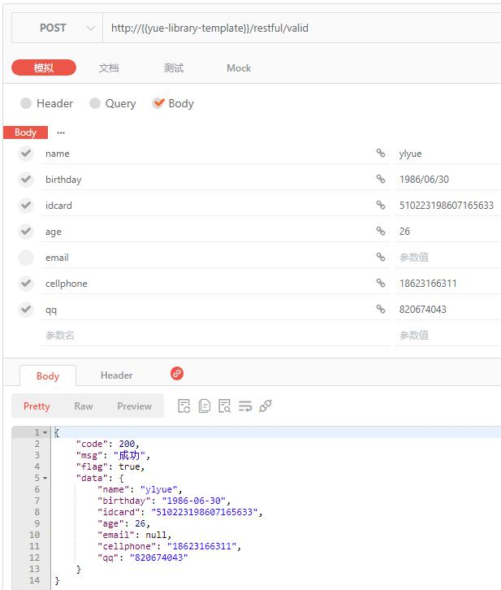

# Restful
## Restful Result
　　`ai.yue.library.base.view.Result<T>` 定义为最外层响应对象，`ai.yue.library.base.view.ResultInfo` 定义为工具类可便捷返回 Restful 风格API结果。

### 示例
**代码如下：**
```java
@PostMapping("/valid")
public Result<?> valid(@Valid ValidationIPO validationIPO) {
	return ResultInfo.success(validationIPO);
}
```

**响应结果如下图所示**：多了一层最外层响应对象



## API接口版本控制
　　在前后端分离、Restful 接口盛行的当下，接口的版本控制是一个成熟的系统所应该拥有的。web模块提供的版本控制，可以方便我们快速构建一个基于版本的api接口。<br>
　　通过 `@ApiVersion` 注解可优雅的实现接口版本控制，注解定义如下：
```java
@Retention(RetentionPolicy.RUNTIME)
@Target({ ElementType.TYPE, ElementType.METHOD })
public @interface ApiVersion {

	/**
	 * Restful API接口版本号
	 * <p>最近优先原则：在方法上的 {@link ApiVersion} 可覆盖在类上面的 {@link ApiVersion}，如下：
	 * <p>类上面的 {@link #value()} 值 = 1.1，
	 * <p>方法上面的 {@link #value()} 值 = 2.1，
	 * <p>最终效果：v2.1
	 */
	double value() default 1;
	
	/**
	 * 是否废弃版本接口
	 * <p>客户端请求废弃版本接口时将抛出错误提示：
	 * <p>当前版本已停用，请升级到最新版本
	 */
	boolean deprecated() default false;
	
}
```

### 快速开始 @ApiVersion 注解的使用
　　版本控制默认为开启状态。可以通过 `yue.api-version.enabled=fasle` 关闭。
```java
@ApiVersion(2)
@RestController
@RequestMapping("/{version}/apiVersion")
public class ApiVersionConroller {

	/**
	 * get
	 * <p>弃用API接口版本演示
	 * 
	 * @param version
	 * @return
	 */
	@ApiVersion(deprecated = true)
	@GetMapping("/get")
	public Result<?> get(@PathVariable String version) {
		return ResultInfo.success("get：" + version);
	}
	
	/**
	 * get2
	 * 
	 * @param version
	 * @return
	 */
	@ApiVersion(value = 2, deprecated = true)
	@GetMapping("/get")
	public Result<?> get2(@PathVariable String version) {
		return ResultInfo.success("get2：" + version);
	}
	
	/**
	 * get3
	 * 
	 * @param version
	 * @return
	 */
	@ApiVersion(3.1)
	@GetMapping("/get")
	public Result<?> get3(@PathVariable String version) {
		return ResultInfo.success("get3：" + version);
	}
	
	/**
	 * get4
	 * 
	 * @param version
	 * @return
	 */
	@ApiVersion(4)
	@GetMapping("/get")
	public Result<?> get4(@PathVariable String version) {
		return ResultInfo.success("get4：" + version);
	}
	
}
```

注解优先级：方法上的 `@ApiVersion` > 类上面的 `@ApiVersion`

#### /v2/apiVersion/get
```json
{
    "code": 410,
    "msg": "当前API接口版本已弃用，请客户端更新接口调用方式",
    "flag": false,
    "data": null
}
```

#### /v3.1/apiVersion/get
```json
{
    "code": 200,
    "msg": "成功",
    "flag": true,
    "data": "get3：v3.1"
}
```

#### /v4/apiVersion/get
```json
{
    "code": 200,
    "msg": "成功",
    "flag": true,
    "data": "get4：v4"
}
```

### API接口版本废弃
　　除了上面所演示的 `@ApiVersion(deprecated=true)` 通过注解来废弃版本之外，我们还提供了最小支持版本统一废弃处理。<br>
　　您可以使用 `yue.api-version.minimum-version` 配置来设置当前系统中允许的最小版本，以此废弃该版本之前的所有版本。如：
```java
yue:
  api-version:
    minimum-version: 2
```

此时小于等于 `v2` 版本的API接口请求均会返回：

```json
{
    "code": 410,
    "msg": "当前API接口版本已弃用，请客户端更新接口调用方式",
    "flag": false,
    "data": null
}
```

## 接口质检标准（可选参考）
　　[接口质检标准参考文档](规约/接口质检标准.md)