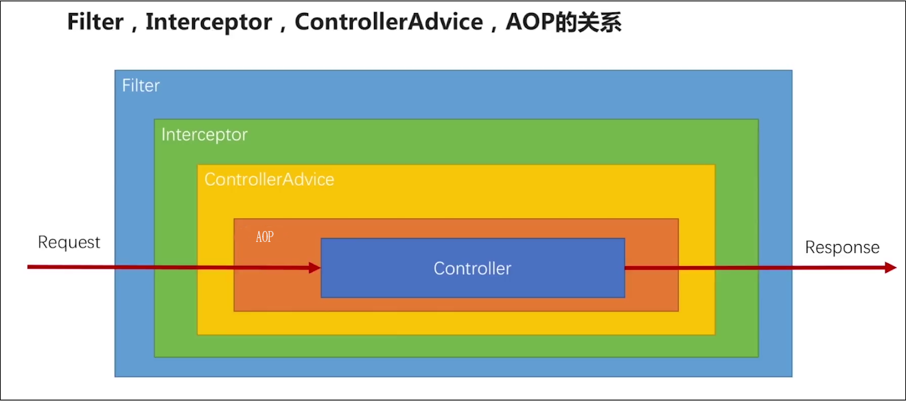

# 统一异常处理
　　`ai.yue.library.base.config.handler.ExceptionHandlerConfig` 全局统一异常处理配置，将拦截 Controller 层抛出的所有异常进行统一处理并响应相应的提示（包括 RESTful 风格的异常提示）

## API 请求路径


## 配置项
```yml
yue:
  exception-handler:
    enabled: true # 默认开启统一异常处理
```

## 示例
**代码示例：**
```java
@PostMapping("/exception")
public Result<?> exception() {
	throw new ParamException("异常测试");
}
```

**响应结果：**
```json
{
    "code": 433,
    "msg": "参数校验未通过，请参照API核对后重试",
    "flag": false,
    "data": "异常测试"
}
```

**控制台内容：**
```java
ai.yue.library.base.exception.ParamException: 异常测试
	at ai.yue.library.template.simple.controller.doc.example.ExceptionController.exception(ExceptionController.java:25)
	at ai.yue.library.template.simple.controller.doc.example.ExceptionController$$FastClassBySpringCGLIB$$17435ec5.invoke(<generated>:-1)
	at org.springframework.cglib.proxy.MethodProxy.invoke(MethodProxy.java:218)
	at org.springframework.aop.framework.CglibAopProxy$CglibMethodInvocation.invokeJoinpoint(CglibAopProxy.java:750)
2020-02-10 22:21:09.986  WARN 33636 --- [nio-8080-exec-1] .m.m.a.ExceptionHandlerExceptionResolver : Resolved [ai.yue.library.base.exception.ParamException: 异常测试]
```

## 异常断言
`ai.yue.library.base.util.Assert`类，可以用于优化`try catch`代码段，解决`try catch`捕获异常后，需要重新抛出或打印对应的业务提示场景。
```java
// 断言-执行给定代码块不会抛出异常
ai.yue.library.base.util.Assert#notThrow
ai.yue.library.base.util.Assert#notThrowIfErrorPrintMsg
ai.yue.library.base.util.Assert#notThrowIfErrorPrintStackTrace
```

测试代码：
```java
@Test
public void assertException() {
	// 执行此代码段，不会抛出异常
	Assert.notThrow("不抛出异常", () -> {
		System.out.println("不抛出异常");
	});

	// 执行此代码段，会抛出异常
	ResultException resultException = Assertions.assertThrows(ResultException.class, () -> {
		Assert.notThrow("抛出异常", () -> {
			int i = 1 / 0;
			System.out.println(i);
		});
	}, "抛出异常");
	System.out.println(resultException);
	Assertions.assertEquals(resultException.getResult().getCode(), 600);
	Assertions.assertEquals(resultException.getResult().getMsg(), "抛出异常");

	// 执行此代码段，会打印异常消息
	Assert.notThrowIfErrorPrintMsg("打印异常消息", System.out::println);
	Assert.notThrowIfErrorPrintMsg("打印异常消息", () -> {
		int i = 1 / 0;
	});

	// 执行此代码段，会打印异常堆栈
	Assert.notThrowIfErrorPrintStackTrace("打印异常堆栈", System.out::println);
	Assert.notThrowIfErrorPrintStackTrace("打印异常堆栈", () -> {
		int i = 1 / 0;
	});
}
```

控制台打印结果：
```java
不抛出异常

ResultException(businessId=0, result=Result(code=600, msg=抛出异常, flag=false, traceId=null, data=null))

17:56:35.189 [main] WARN ai.yue.library.base.util.Assert - 打印异常消息

17:56:35.191 [main] WARN ai.yue.library.base.util.Assert - 打印异常堆栈
java.lang.ArithmeticException: / by zero
	at ai.yue.library.test.jdbc.AssertTest.lambda$assertException$4(AssertTest.java:43)
	at ai.yue.library.base.util.Assert.notThrowIfErrorPrintStackTrace(Assert.java:54)
	at ai.yue.library.test.jdbc.AssertTest.assertException(AssertTest.java:42)
	at java.base/jdk.internal.reflect.NativeMethodAccessorImpl.invoke0(Native Method)
	at java.base/jdk.internal.reflect.NativeMethodAccessorImpl.invoke(NativeMethodAccessorImpl.java:62)
	at java.base/jdk.internal.reflect.DelegatingMethodAccessorImpl.invoke(DelegatingMethodAccessorImpl.java:43)
	at java.base/java.lang.reflect.Method.invoke(Method.java:566)
	at org.junit.platform.commons.util.ReflectionUtils.invokeMethod(ReflectionUtils.java:725)
```
