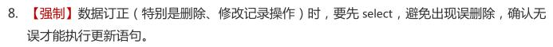

# CRUD
`AbstractDAO`类提供的默认实现，其实也是基于`Db`类进行操作，我们也可以使用`Db`类来实现我们所有的`CRUD`操作，<font color=red>**此处只介绍`AbstractDAO`类，没有默认实现的部分方法的使用方式**</font>

## 增
### 插入数据-自动递增 sort_idx :id=sort_idx
<font color=red>可用于数据需要自定义排序的插入操作，使用条件：</font>

1. `id` 默认为主键
2. `sort_idx` 默认为排序字段，类型为 int unsigned 。DDL示例：`sort_idx` tinyint(2) UNSIGNED NOT NULL COMMENT '排序-索引'

```java
/**
 * 插入数据-自动递增 sort_idx
 * @param paramJson
 * @return
 */
public Long insert(JSONObject paramJson) {
	String uniqueKeys = "name";// 可选参数
	return db.insertWithSortIdxAutoIncrement(tableName(), paramJson, uniqueKeys);
}
```

### 插入或更新
当数据操作不确定时可执行此操作。建议某些特殊场景使用，一般业务可先查询判断，给予前端友好提示，再执行插入操作
```java
/**
 * 插入或更新
 * @param paramJson
 * @return
 */
public Long insertOrUpdate(JSONObject paramJson) {
	String[] conditions = {"id"};
	return db.insertOrUpdate(tableName(), paramJson, conditions, DBUpdateEnum.正常);
}
```

## 删
**《Java开发手册》数据订正规约：**


### 通过表中某个字段删除多条数据
```java
/**
 * 删除
 * @param name
 */
public void deleteByName(String name) {
	JSONObject paramJson = new JSONObject();
	paramJson.put("name", name);
	db.delete(tableName(), paramJson);
}
```

### 批量删除数据，一组条件对应一条数据，并且每组条件都采用相同的key
```java
	/**
	 * 删除-批量
	 * @param paramJsons
	 */
	public void deleteBatch(JSONObject[] paramJsons) {
		db.deleteBatch(tableName(), paramJsons);
	}
```

### 批量删除数据，指定SQL语句以创建预编译执行SQL和绑定删除参数
```java
/**
 * 删除-批量
 * @param paramJsons
 */
public void deleteBatch2(JSONObject[] paramJsons) {
	String sql =
			"DELETE \n" +
			"FROM\n" +
			"	table_example \n" +
			"WHERE\n" +
			"	1 = 1 \n" +
			"	AND user_id > :user_id";
	int[] updateRowsNumbers = db.deleteBatch2(sql, paramJsons);
	Console.log(Arrays.toString(updateRowsNumbers));
}
```

## 改
### 根据ID更新
```java
/**
 * 更新-ById
 * @param paramJson
 */
public void updateById(JSONObject paramJson) {
	db.updateById(tableName(), paramJson, DBUpdateEnum.递减_无符号);
}

// ...更多重载方法
```

### 根据条件更新
```java
/**
 * 更新-ByName
 * @param paramJson
 */
public void updateByName(JSONObject paramJson) {
	String[] conditions = {"name"};
	long updateRowsNumber = db.update(tableName(), paramJson, conditions);
	int expectedValue = 1;
	db.updateAndExpectedEqual(updateRowsNumber, expectedValue);
}

// ...更多重载方法
```

### 更新-排序
使用限制见： [插入数据-自动递增 sort_idx](#sort_idx)
```java
/**
 * 更新-排序
 * @param id
 * @param move
 */
public void updateSort(Long id, Integer move) {
	String uniqueKeys = "name";
	db.updateSort(tableName(), id, move, uniqueKeys);
}
```

### 更新-批量
```java
/**
 * 更新-批量
 * @param paramJsons
 */
public void updateBatch(JSONObject[] paramJsons) {
	String sql =
			"UPDATE table_example \n" +
			"SET nickname = :nickname \n" +
			"WHERE\n" +
			"	1 = 1 \n" +
			"	AND user_id > :user_id";
	int[] updateRowsNumbers = db.updateBatch(sql, paramJsons);
	Console.log(Arrays.toString(updateRowsNumbers));
}

// ...更多重载方法
```

## 查
### 列表
```java
/**
 * 列表
 * 
 * @param paramJson 查询参数
 * @return 列表数据
 */
public List<JSONObject> list(JSONObject paramJson) {
	return db.query(tableName(), paramJson, DBSortEnum.降序);
}

// ...更多重载方法
```

### SQL查询
```java	
queryForJson(String, JSONObject)
queryForObject(String, JSONObject, Class<T>)
queryForList(String, JSONObject)
queryForList(String, JSONObject, Class<T>)
```

更多方法请参阅API文档...

### 分页
**《Java开发手册》分页优化规约：**


`PageIPO`类就是一个分页实体类，包含`page`（当前页）、`limit`（每页显示的条数）、`conditions`（查询条件）

#### 条件分页
```java
/**
 * 分页
 * @param pageIPO
 * @return
 */
public PageVO pageWhere(PageIPO pageIPO) {
	String whereSql = "WHERE 1 = 1 AND user_id >= :user_id";
	return db.pageWhere(tableName(), whereSql, pageIPO);
}

// ...更多重载方法
```

#### 复杂分页，传入SQL查询语句
```java
/**
 * 分页
 * @param pageIPO
 * @return
 */
public PageVO pageSql(PageIPO pageIPO) {
	String querySql = "";
	return db.pageSql(querySql, pageIPO);
}

// ...更多重载方法
```

#### 根据相同的列表条件，获得上一条与下一条数据
使用场景：抖音刷视频等
```java
/**
 * 分页-上一条与下一条数据
 * 
 * @param pageIPO
 * @return
 */
public PageBeforeAndAfterVO pageBeforeAndAfter(PageIPO pageIPO) {
	String querySql = "";
	Long equalsId = 30L;
	return db.pageBeforeAndAfter(querySql, pageIPO, equalsId);
}

// ...更多重载方法
```

### 逻辑删除数据剔除查询
#### 全局配置


#### 单个DAO配置
```java
public class OrgPersonRelationDAO extends AbstractRepository<BaseOrgPersonRelationDO> {

	@PostConstruct
	private void init() {
		db = db.clone();
		db.setEnableDeleteQueryFilter(true);
	}
	
	...
}
```

更多方法请参阅API文档...