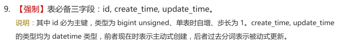

## BaseEntity <!-- {docsify-ignore} -->
在 POJO 规范中，`Entity` 为数据对象，一般情况下与数据库表结构一一对应，通过 `Mapper` 层向上传输数据源对象。

BaseEntity将表中的必备字段进行了规范整理，**可根据需求选择继承或复制表字段**，即可遵守bl数据库规约。
- 使用规范的字段可获得bl的 [数据审计](data/mybatis/数据审计.md) 支持（自动填充创建时与更新时的基础数据）
- 如果你的表需要剔除部分基础字段，你可以选择只复制你需要的字段到你的实体类即可

使用示例：
```java
@Data
@ToString(callSuper = true)
@EqualsAndHashCode(callSuper = true)
public class TableExample extends BaseEntity {

	private static final long serialVersionUID = 6404495051119680239L;

	@TableField(fill = FieldFill.INSERT)
	String tenantSysId;
	String tenantCoId;
	String fieldOne;
	String fieldTwo;
	String fieldThree;

}
```

### lombok使用
**`@SuperBuilder`与`@Builder`注解使用注意：**

`@Builder`注解不会构建父类属性，故**BaseEntity**默认已加上`@SuperBuilder`注解，子类需要使用建造者模式时，同样加上`@SuperBuilder(toBuilder = true)`注解即可，如下：
```java
@Data
@NoArgsConstructor
@AllArgsConstructor
@ToString(callSuper = true)
@SuperBuilder(toBuilder = true)
@EqualsAndHashCode(callSuper = true)
public class Subclass extends BaseEntity {
```

### BaseEntity源码速览
```java
@Data
@NoArgsConstructor
@SuperBuilder(toBuilder = true)
public abstract class BaseEntity implements Serializable {
	
	private static final long serialVersionUID = 2241197545628586478L;

	/**
	 * 有序主键：单表时数据库自增、分布式时雪花自增
	 */
	@TableId
	protected Long id;

	/**
	 * 排序索引
	 */
	protected Integer sortIdx;

	/**
	 * 创建人：用户名、昵称、人名
	 */
	@TableField(fill = FieldFill.INSERT)
	protected String createUser;

	/**
	 * 创建人：用户id
	 */
	@TableField(fill = FieldFill.INSERT)
	protected Long createUserId;

	/**
	 * 创建时间
	 */
	@TableField(fill = FieldFill.INSERT)
	protected Long createTime;

	/**
	 * 更新人：用户名、昵称、人名
	 */
	@TableField(fill = FieldFill.INSERT_UPDATE)
	protected String updateUser;

	/**
	 * 更新人：用户id
	 */
	@TableField(fill = FieldFill.INSERT_UPDATE)
	protected Long updateUserId;

	/**
	 * 更新时间
	 */
	@TableField(fill = FieldFill.INSERT_UPDATE)
	protected Long updateTime;

	/**
	 * 删除时间：默认0（未删除）
	 * <p>一般不作查询展示
	 */
	@TableLogic(delval = "now()")
	protected Long deleteTime;

}
```

BaseEntity 对应的 MySQL DDL
```sql
CREATE TABLE `table_example` (
  `id` bigint unsigned NOT NULL AUTO_INCREMENT COMMENT '有序主键：单表时数据库自增、分布式时雪花自增',
  `sort_idx` int unsigned NOT NULL DEFAULT '0' COMMENT '排序索引',
  `create_user` varchar(60) CHARACTER SET utf8mb4 COLLATE utf8mb4_0900_ai_ci NOT NULL COMMENT '创建人：用户名、昵称、人名',
  `create_user_id` bigint unsigned NOT NULL COMMENT '创建人：用户id',
  `create_time` bigint unsigned NOT NULL COMMENT '创建时间',
  `update_user` varchar(60) CHARACTER SET utf8mb4 COLLATE utf8mb4_0900_ai_ci NOT NULL COMMENT '更新人：用户名、昵称、人名',
  `update_user_id` bigint unsigned NOT NULL COMMENT '更新人：用户id',
  `update_time` bigint unsigned NOT NULL COMMENT '更新时间',
  `delete_time` bigint unsigned NOT NULL DEFAULT '0' COMMENT '删除时间：默认0（未删除）',
  `tenant_sys_id` varchar(36) CHARACTER SET utf8mb4 COLLATE utf8mb4_0900_ai_ci NOT NULL COMMENT '系统租户：一级租户（dict_tenant_sys）',
  `tenant_co_id` varchar(36) CHARACTER SET utf8mb4 COLLATE utf8mb4_0900_ai_ci NOT NULL COMMENT '企业租户：二级租户',
  PRIMARY KEY (`id`) USING BTREE
) ENGINE=InnoDB DEFAULT CHARSET=utf8mb4 COLLATE=utf8mb4_0900_ai_ci COMMENT='建表规范示例：提供基础字段规范';
```

> 主键`id`：bigint类型、无符号、自动递增、不能为NULL
> - 其实这样做也符合了《Java开发手册》MySQL数据库-建表规约第九条：<br>
> 
> <br>
>
> 更多使用示例：[👉Mapper、Service、Controller示例](data/mybatis/Mapper、Service、Controller示例.md)
>
> 更多相关特性：[👉数据审计](data/mybatis/数据审计.md)
