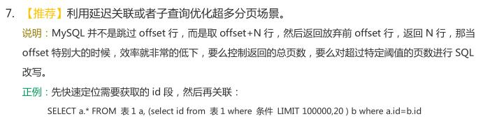

# 分页
data-mybatis使用[PageHelper](https://github.com/pagehelper/Mybatis-PageHelper)实现分页

## 分页规范
**接口请求参数约定**

|参数名称		|参数类型	|最大长度	|描述							|示例									|
|--				|--			|--			|--								|--										|
|`pageNum`		|Int		|8			|分页查询-当前页					|1										|
|`pageSize`		|Int		|6			|分页查询-每页显示条数			|20										|
|`orderBy`	    |String		|50			|分页查询-排序字段				|id desc    							|

`BaseService`中的page方法，会自动调用`PageHelper.startPage(ServletUtils.getRequest())`来获取前端请求参数。

## 使用示例
调用startPage()方法，传入ServletRequest，自动获取前端的请求参数，开启分页查询，因此分页查询参数无需在IPO中定义
```java
// 调用startPage()方法，传入ServletRequest，自动获取前端的请求参数，开启分页查询，因此分页查询参数无需在IPO中定义
PageHelper.startPage(ServletUtils.getRequest())
```

## 分页优化
`PageHelper.startPage(ServletUtils.getRequest())`方法，可以很方便的实现分页查询，但默认的实现未进行SQL优化，如果在数据大表的情况下进行分页，当查询到最后几条数据时，会发现分页速度很慢。

因此你需要遵循**《Java开发手册》分页优化规约：**



> [👉参考资料：为什么需要分页优化1](https://mp.weixin.qq.com/s/1n-mwVeqb0bjP9IROmjnnw)<br>
> [👉参考资料：为什么需要分页优化2](https://www.cnblogs.com/lisqiong/p/5635009.html)

### 示例sql
示例sql为sql优化型分页sql，解决mysql limit分页缺陷

```xml
<select id="pageExample" resultType="ai.yue.library.test.docs.example.data.mybatis.TableExample">
    SELECT a.*
    FROM table_example a,
         (SELECT id FROM table_example WHERE column > 5 ORDER BY id DESC LIMIT 0, 10) b
    WHERE a.id = b.id
</select>
```
