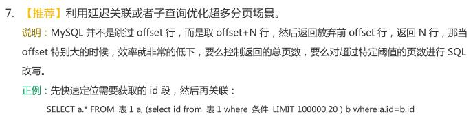

## 分页 <!-- {docsify-ignore} -->
data-mybatis使用[PageHelper](https://github.com/pagehelper/Mybatis-PageHelper)实现分页

### 接口请求参数约定
|参数名称		|参数类型	|最大长度	|描述							|示例									|
|--				|--			|--			|--								|--										|
|`pageNum`		|Int		|8			|分页查询-当前页					|1										|
|`pageSize`		|Int		|6			|分页查询-每页显示条数			|20										|
|`orderBy`	    |String		|50			|分页查询-排序字段				|id desc    							|

### 分页查询
调用`PageHelper.startPage()`方法，传入ServletRequest，自动获取前端的请求参数，开启分页查询，因此分页查询参数无需在IPO中定义

```java
public Result<?> page(String fieldOne, String fieldTwo) {
    // 开启分页：PageHelper.startPage() 必须紧跟在 MyBatis 查询方法后面
    PageHelper.startPage(ServletUtils.getRequest());
    
    // 执行查询：跟紧查询，避免分页线程串线
    List<TableExample> list = super.lambdaQuery()
            .eq(TableExample::getFieldOne, fieldOne)
            .eq(TableExample::getFieldTwo, fieldTwo)
            .list();

    // 返回分页结果：调用 PageInfo.of()
    PageInfo<TableExample> pageInfo = PageInfo.of(list);
    return R.success(pageInfo);
}
```

### 分页优化
`PageHelper.startPage(ServletUtils.getRequest())`方法，可以很方便的实现分页查询，但默认的实现未进行SQL优化，如果在数据大表的情况下进行分页，当查询到最后几条数据时，会发现分页速度很慢。

因此你需要遵循**《Java开发手册》分页优化规约：**
> 
>
> **规约文字版**：利用延迟关联或子查询优化超多分页场景。
> MySQL 并不是跳过 offset 行，而是取 offset+N 行后返回前 offset 行、丢弃这些行、只取后 N 行，因此当 offset 特别大时效率很低。
> 优化思路：先用覆盖索引（仅查主键 id）配合 limit 快速定位目标主键，再回表关联取完整数据，避免大 offset 下的全字段扫描。
>
> - [👉参考资料：为什么需要分页优化1](https://mp.weixin.qq.com/s/1n-mwVeqb0bjP9IROmjnnw)<br>
> - [👉参考资料：为什么需要分页优化2](https://www.cnblogs.com/lisqiong/p/5635009.html)

示例sql为sql优化型分页sql，解决mysql limit分页缺陷

```xml
<select id="pageExample" resultType="ai.yue.library.test.docs.example.data.mybatis.TableExample">
    SELECT a.*
    FROM table_example a,
         (SELECT id FROM table_example WHERE column > 5 ORDER BY id DESC LIMIT 0, 10) b
    WHERE a.id = b.id
</select>
```
