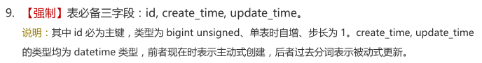

# 快速开始
　　data-mybatis模块基于Mybatis-Plus封装的ORM框架，拥有着强大性能的同时又不失简单灵活，特性如下：
- **强大易用**：比MyBatis更方便好用、比SpringJpa更简单灵活、比SpringJdbc更健壮完善
- **无侵入**：data-mybatis在Mybatis-Plus的基础上进行扩展，只做增强不做改变，简化`CRUD`等操作
- **依赖管理**：引入即可启动项目，关联druid实现SQL全监控
- **预防Sql注入**：内置Sql注入剥离器，有效预防Sql注入攻击
- **损耗小**：封装大量经过SQL优化处理的CRUD方法，直接面向对象操作，对比原生级CRUD处理，性能基本无损甚至更优
- **通用CRUD操作**：内置通用DAO，通过继承方式即可实现单表大部分CRUD操作
- **更科学的分页**：分页参数统一处理，无多线程忧虑，自由拼接更通用，无分页性能忧虑，更有优化型分页SQL检查
- **内置性能分析插件**：可输出Sql语句以及其执行时间，建议开发测试时启用该功能，能有效解决慢查询
- **类型强化**：支持原生级SQL查询，并强化原生查询结果，简单便捷+可维护组合（支持全Json或全Entity）
- **CRUD校验**：CRUD操作是否符合预期，更好的避免脏数据的产生与违规操作
- **数据审计**：敏感操作全覆盖，简单实现对数据变动的审计需求
- **数据填充**：只需简单的配置即可实现字段默认值填充需求，新增与修改时数据自动填充
- **数据脱敏**：只需简单的配置即可实现对数据脱敏存储需求，操作时自动加解密
- **多租户**：完善的多租户方案与规范的框架支持，从容应对多租户需求，数据源SaaS隔离简单规范化
- **全局异常处理**：CRUD操作相关异常统一处理，定位更精准，提示更友好，实现全局RESTful风格

## 引入模块
`yue-library-dependencies`作为父项目，在`pom.xml`文件中添加：
``` pom
<dependencies>
	<dependency>
		<groupId>ai.ylyue</groupId>
		<artifactId>yue-library-data-mybatis</artifactId>
	</dependency>
</dependencies>
```

## 添加配置
### 配置数据源
`data-mybatis`就是Mybatis 3的封装，数据源配置如下：
```yaml
spring:
  datasource: 
    druid: 
      url: jdbc:mysql://localhost:3306/database?characterEncoding=utf-8&useSSL=false
      username: root
      password: 02194096e7d840a992a2f627629a94da             # 养成良好习惯，无论任何环境不使用弱密码
```

### 启用yue-library提供的默认配置（可选）
在 `application.yml` 或 `bootstrap.yml` 文件中添加如下示例配置，导入 **yue-library** 提供的默认配置支持。
- 如：打印可执行SQL
```yml
spring:
  profiles:
    group:
      "yue": "yue-library-data-mybatis"
    active: yue
    ...
```

## 开始使用
### 继承BaseMapper
`data-mybatis`所有的CRUD方法都在`BaseMapper`类里面，所以使用时只需要继承`BaseMapper`即可。<br>
<font color=red>注意：sql数据表中主键的DDL最好同下面一样。</font>
```ddl
`id` bigint(20) unsigned NOT NULL AUTO_INCREMENT COMMENT '有序主键：单表时数据库自增、分布式时雪花自增'
```
主键ID：bigint类型、无符号、自动递增、不能为NULL
> 其实这样做也符合了《Java开发手册》MySQL数据库-建表规约第九条：<br>
> 

字段映射支持下划线与驼峰自动识别转换：

> 实际中可能会遇到类型转换问题，可使用 `Convert` 类进行转换，支持DO、Json、List等相互转换

```java
@Mapper
public interface TableExampleMapper extends BaseMapper<TableExample> {

}
```

### 建表规范示例
```sql
CREATE TABLE `table_example` (
  `id` bigint unsigned NOT NULL AUTO_INCREMENT COMMENT '有序主键：单表时数据库自增、分布式时雪花自增',
  `sort_idx` int unsigned NOT NULL DEFAULT '0' COMMENT '排序索引',
  `create_user` varchar(60) CHARACTER SET utf8mb4 COLLATE utf8mb4_0900_ai_ci NOT NULL COMMENT '创建人：用户名、昵称、人名',
  `create_user_id` varchar(32) CHARACTER SET utf8mb4 COLLATE utf8mb4_0900_ai_ci NOT NULL COMMENT '创建人：用户id',
  `create_time` datetime NOT NULL DEFAULT CURRENT_TIMESTAMP COMMENT '创建时间',
  `update_user` varchar(60) CHARACTER SET utf8mb4 COLLATE utf8mb4_0900_ai_ci DEFAULT NULL COMMENT '更新人：用户名、昵称、人名',
  `update_user_id` varchar(36) CHARACTER SET utf8mb4 COLLATE utf8mb4_0900_ai_ci DEFAULT NULL COMMENT '更新人：用户id',
  `update_time` datetime NOT NULL DEFAULT CURRENT_TIMESTAMP ON UPDATE CURRENT_TIMESTAMP COMMENT '更新时间',
  `delete_time` bigint unsigned NOT NULL DEFAULT '0' COMMENT '删除时间：默认0（未删除）',
  `tenant_sys` varchar(36) CHARACTER SET utf8mb4 COLLATE utf8mb4_0900_ai_ci NOT NULL COMMENT '系统租户：一级租户（dict_tenant_sys）',
  `tenant_co` varchar(36) CHARACTER SET utf8mb4 COLLATE utf8mb4_0900_ai_ci NOT NULL COMMENT '企业租户：二级租户',
  PRIMARY KEY (`id`) USING BTREE
) ENGINE=InnoDB DEFAULT CHARSET=utf8mb4 COLLATE=utf8mb4_0900_ai_ci COMMENT='建表规范示例：提供基础字段规范';
```

---

## 更多示例教程
> SpringBoot示例工程见 [👉template-boot](samples/template-boot.md)

!> <font color=red>以下教程仅供参考与学习</font>，强烈推荐使用 [`👉ai.yue.library.data.mybatis.service.BaseService`](data/jdbc/BaseService.md) 进行数据库CRUD操作。<br>避免重复踩坑与无法使用到yue-library所提供的增强与优化后的实用特性。

> [👉mybatis-3](https://github.com/mybatis/mybatis-3)<br>
> [👉mybatis-spring-boot-starter](https://github.com/mybatis/spring-boot-starter)<br>
> [👉MyBatis-Plus](https://baomidou.com/)<br>
> [👉PageHelper](https://github.com/pagehelper/Mybatis-PageHelper)<br>
> [👉动态数据源](https://github.com/baomidou/dynamic-datasource-spring-boot-starter)<br>
> [👉druid](https://github.com/alibaba/druid/wiki/%E5%B8%B8%E8%A7%81%E9%97%AE%E9%A2%98)
