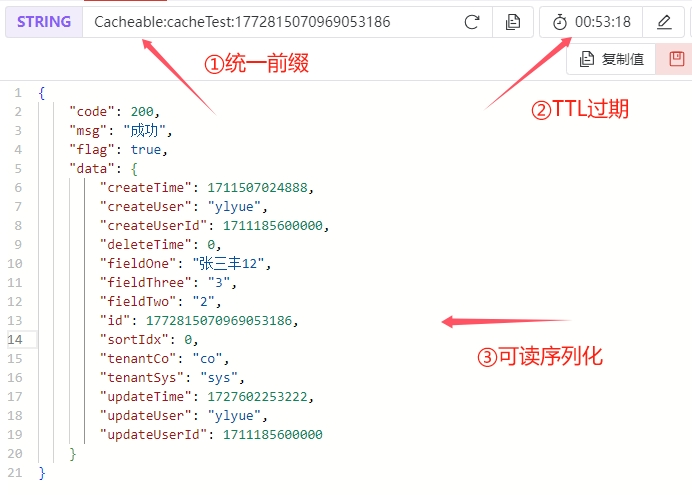

## 二级缓存 <!-- {docsify-ignore} -->
[jetcache](https://github.com/alibaba/jetcache) 二级缓存：
1. `CaffeineCache`一级缓存（本地/内存缓存）
2. `RedisCache`二级缓存
3. 支持TTL
4. 统一缓存前缀
5. redis订阅监听缓存同步
6. 高性能可读序列化

### 快速开始
1. 启用`yue-library-data-redis`配置文件
```yaml
spring:
  profiles:
    group:
      "yue-library": "yue-library-web,yue-library-data-mybatis,yue-library-data-redis"
    active: yue-library
```

2. 启用缓存`@EnableMethodCache(basePackages = "你的包扫描路径")`

3. 使用缓存
```java
public interface UserService {
    @Cached(name="userCache:", key="#userId", cacheType = CacheType.BOTH, syncLocal = true, expire = 3600)
    User getUserById(long userId);

    @CacheUpdate(name="userCache:", key="#user.userId", value="#user")
    void updateUser(User user);

    @CacheInvalidate(name="userCache:", key="#userId")
    void deleteUser(long userId);
}
```

### 注解详解
- `@Cached`添加/获取缓存
- `@CacheUpdate`更新缓存
- `@CacheInvalidate`删除缓存
- `@CacheRefresh`间隔刷新缓存

> - [SpEL表达式](https://www.jianshu.com/p/a8b2d5886129)
> - [SpEL表达式详解](https://blog.csdn.net/weixin_43888891/article/details/127520555)

#### @Cached（添加/获取缓存）

|属性			|默认值				|说明																																																																	|
|:-:			|:-:				|:-																																																																	|
|area			|“default”		    |如果在配置中配置了多个缓存area，在这里指定使用哪个area																																																					|
|name			|未定义				|指定缓存的唯一名称，不是必须的，如果没有指定，会使用类名+方法名。name会被用于远程缓存的key前缀。另外在统计中，一个简短有意义的名字会提高可读性。																														|
|key			|未定义				|使用SpEL指定key，如果没有指定会根据所有参数自动生成。																																																					|
|expire			|未定义				|超时时间。如果注解上没有定义，会使用全局配置，如果此时全局配置也没有定义，则为无穷大																																													|
|timeUnit		|TimeUnit.SECONDS	|指定expire的单位																																																														|
|cacheType		|CacheType.REMOTE	|缓存的类型，包括CacheType.REMOTE、CacheType.LOCAL、CacheType.BOTH。如果定义为BOTH，会使用LOCAL和REMOTE组合成两级缓存																																					|
|localLimit		|未定义				|如果cacheType为LOCAL或BOTH，这个参数指定本地缓存的最大元素数量，以控制内存占用。如果注解上没有定义，会使用全局配置，如果此时全局配置也没有定义，则为100																												|
|localExpire	|未定义				|仅当cacheType为BOTH时适用，为内存中的Cache指定一个不一样的超时时间，通常应该小于expire																																													|
|serialPolicy	|未定义				|指定远程缓存的序列化方式。可选值为SerialPolicy.JAVA和SerialPolicy.KRYO。如果注解上没有定义，会使用全局配置，如果此时全局配置也没有定义，则为SerialPolicy.JAVA																											|
|keyConvertor	|未定义				|指定KEY的转换方式，用于将复杂的KEY类型转换为缓存实现可以接受的类型，当前支持KeyConvertor.FASTJSON和KeyConvertor.NONE。NONE表示不转换，FASTJSON可以将复杂对象KEY转换成String。如果注解上没有定义，会使用全局配置。														|
|enabled		|true				|是否激活缓存。例如某个dao方法上加缓存注解，由于某些调用场景下不能有缓存，所以可以设置enabled为false，正常调用不会使用缓存，在需要的地方可使用CacheContext.enableCache在回调中激活缓存，缓存激活的标记在ThreadLocal上，该标记被设置后，所有enable=false的缓存都被激活	|
|cacheNullValue	|false				|当方法返回值为null的时候是否要缓存																																																										|
|condition		|未定义				|使用SpEL指定条件，如果表达式返回true的时候才去缓存中查询																																																				|
|postCondition	|未定义				|使用SpEL指定条件，如果表达式返回true的时候才更新缓存，该评估在方法执行后进行，因此可以访问到#result																																									|

#### @CacheUpdate（更新缓存）
|属性		|默认值		|说明																			|
|:-:		|:-:		|:-																			|
|area		|“default”|如果在配置中配置了多个缓存area，在这里指定使用哪个area，指向对应的@Cached定义。|
|name		|未定义		|指定缓存的唯一名称，指向对应的@Cached定义。									|
|key		|未定义		|使用SpEL指定key																|
|condition	|未定义		|使用SpEL指定条件，如果表达式返回true才执行删除，可访问方法结果#result			|

#### @CacheInvalidate（删除缓存）
|属性		|默认值		|说明																			|
|:-:		|:-:		|:-																			|
|area		|“default”|如果在配置中配置了多个缓存area，在这里指定使用哪个area，指向对应的@Cached定义。|
|name		|未定义		|指定缓存的唯一名称，指向对应的@Cached定义。									|
|key		|未定义		|使用SpEL指定key																|
|value		|未定义		|使用SpEL指定value																|
|condition	|未定义		|使用SpEL指定条件，如果表达式返回true才执行更新，可访问方法结果#result			|

#### @CacheRefresh（间隔刷新缓存）
|属性						|默认值				|说明																														|
|:-:						|:-:				|:-																														|
|refresh					|未定义				|刷新间隔																													|
|timeUnit					|TimeUnit.SECONDS	|时间单位																													|
|stopRefreshAfterLastAccess	|未定义				|指定该key多长时间没有访问就停止刷新，如果不指定会一直刷新																	|
|refreshLockTimeout			|60秒				|类型为BOTH/REMOTE的缓存刷新时，同时只会有一台服务器在刷新，这台服务器会在远程缓存放置一个分布式锁，此配置指定该锁的超时时间|

#### 测试
```java
@GetMapping("/getCache")
@Cached(name = "cacheTest:", key = "#id", cacheType = CacheType.BOTH, syncLocal = true, expire = 3600)
public Result<?> getCache(Long id) {
    System.out.println("未命中Redis缓存，使用JDBC去数据库查询数据。");
    return R.success(tableExampleService.getById(id));
}
```

http://localhost:8080/getCache?id=1772815070969053186

**第一次访问-控制台打印结果：**
```log
2024-09-30 09:44:16.889  INFO 49504 --- [nio-8080-exec-2] a.y.l.test.aspect.HttpRequestFilter      : request: {"requestIp":"0:0:0:0:0:0:0:1","requestUri":"GET /cacheJetcache/getCache"}
未命中Redis缓存，使用JDBC去数据库查询数据。
2024-09-30 09:44:17.418 DEBUG 49504 --- [nio-8080-exec-2] druid.sql.Statement                      : {conn-10005, pstmt-20000} executed. select id, field_one, field_two, field_three, tenant_co
	, tenant_sys, sort_idx, create_user, create_user_id, create_time
	, update_user, update_user_id, update_time, delete_time
from table_example_standard
where id = 1772815070969053186
	and delete_time = 0
```

**第一次访问-响应数据：**
```json
{
    "code": 200,
    "msg": "成功",
    "flag": true,
    "traceId": "",
    "data": {
        "id": 1772815070969053186,
        "sortIdx": 0,
        "createUser": "ylyue",
        "createUserId": 1711185600000,
        "createTime": 1711507024888,
        "updateUser": "ylyue",
        "updateUserId": 1711185600000,
        "updateTime": 1727602253222,
        "deleteTime": 0,
        "fieldOne": "张三丰12",
        "fieldTwo": "2",
        "fieldThree": "3",
        "tenantCo": "co",
        "tenantSys": "sys"
    }
}
```

**第二次访问：结果与第一次相同，但未打印出查询日志，因此证明响应的结果是取的缓存数据，而不是执行的JDBC查询。同时我们也确认下Redis中是否有缓存数据：**



1. 统一前缀`Cacheable`，配置项：`jetcache.remote.default.keyPrefix`
2. 统一过期时间`604800000`(7天)，单KEY TTL过期未配置时，将使用全局配置项：`jetcache.remote.default.expireAfterWriteInMillis`
3. 统一可读序列化（最大性能与兼容性）

**第三次访问：删除redis中的缓存数据后，再次访问，仍然响应缓存结果，证明一级缓存也已生效**

#### 批量API
1. 创建缓存实例

```java
@Autowired
private CacheManager cacheManager;
private Cache<Long, TableExampleStandard> cacheTest;

@PostConstruct
public void init() {
    QuickConfig qc = QuickConfig.newBuilder("cacheTestBatch:")
            .expire(Duration.ofSeconds(100))
            .cacheType(CacheType.BOTH) // two level cache
            .syncLocal(true) // invalidate local cache in all jvm process after update
            .build();
    cacheTest = cacheManager.getOrCreateCache(qc);
}
```

2. 使用批量api

```java
Map<K,V> getAll(Set<? extends K> keys);
void putAll(Map<? extends K,? extends V> map);
void removeAll(Set<? extends K> keys);
```

3. 使用示例

```java
public Result<?> getCacheBatch(Set<Long> ids) {
    // 查询缓存
    Map<Long, TableExampleStandard> all = cacheTest.getAll(ids);

    if (all.size() != ids.size()) {
        System.out.println("未命中Redis缓存，使用JDBC去数据库查询数据。");
        // 查询数据库
        List<TableExampleStandard> list = tableExampleService.listByIds(ids);
        for (TableExampleStandard tableExampleStandard : list) {
            all.put(tableExampleStandard.getId(), tableExampleStandard);
        }

        // 设置缓存
        cacheTest.putAll(all);
    }

    return R.success(all);
}
```

#### 维护缓存
上面我们介绍了如何使用`@Cached`注解添加与获取缓存，实际场景中我们还需要更新缓存`@CacheUpdate`与删除缓存`@CacheInvalidate`。
开发者需要结合业务情况，在需要操作到缓存相关数据时，进行缓存数据同步，也就是更新或删除缓存，需求多变灵活运用。

##### 1. 关于缓存同步
使用注解`@Cached(cacheType = CacheType.BOTH, syncLocal = true)`使用二级缓存，并开启一级缓存同步后：
- 使用注解`@CacheUpdate`进行缓存的**更新**
- 使用注解`@CacheInvalidate`进行缓存的**删除**
- 使用注解`@CacheRefresh`进行缓存的**间隔刷新**
皆可实现一级缓存的自动同步，一级缓存的同步是基于redis的发布/订阅机制实现

!> 注意：当你直接在数据库或redis中修改值的时候，<font color=red>修改后的数据将不会同步至一级缓存</font>

##### 2. 只使用本地缓存或只使用远程缓存
`@Cached`注解中的CacheType属性，控制缓存等级：CacheType.REMOTE=**远程缓存**、CacheType.LOCAL=**本地缓存**、CacheType.BOTH=**二级缓存**

##### 3. 关于OOM
- [l2cache热key探测-技术方案调研](https://blog.csdn.net/icansoicrazy/article/details/130885982)
- [关于缓存的几个常见问题分析和处理方案](https://blog.csdn.net/icansoicrazy/article/details/106635446)
- [实战-用户中心-l2cache-Caffeine的OOM异常分析](https://blog.csdn.net/icansoicrazy/article/details/108923992)
- [实战-用户中心-还原并验证使用caffeine出现频繁gc和oom的场景](https://blog.csdn.net/icansoicrazy/article/details/108934105)
- [实战-商品中心-Redis集群版超出最大内存限制异常](https://blog.csdn.net/icansoicrazy/article/details/108810679)
- [实战-商品中心-l2cache高并发场景下出现OOM的分析和优化方案](https://blog.csdn.net/icansoicrazy/article/details/112274052)
- [实战-商品中心-l2cache中caffeine.getIfPresent()仅仅获取缓存，但触发了数据加载，导致被设置为NullValue的问题分析](https://blog.csdn.net/icansoicrazy/article/details/125096876)

### 扩展资料
<!-- > [👉示例源码](https://gitee.com/yl-yue/yue-library/tree/master/yue-library-samples/yue-library-test)<br> -->
> [👉Redis缓存雪崩、击穿、穿透、预热、降级详解](https://mp.weixin.qq.com/s/O8eedi3X2TSeeUI6iWF-wA)
