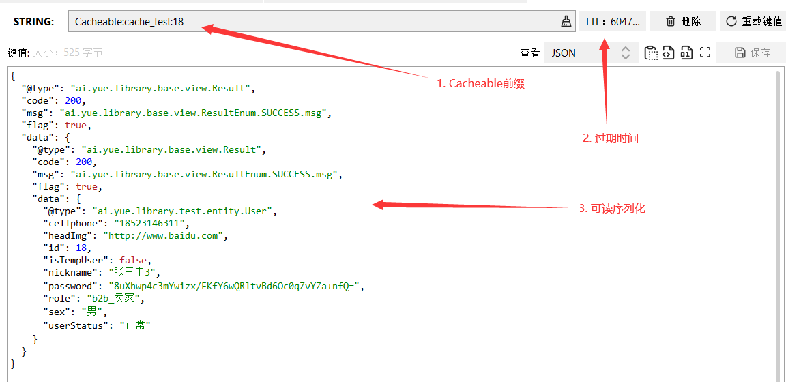

# 分布式缓存
Spring为我们提供了三大注解`@Cacheable`、`@CachePut`、`@CacheEvict`可在绝大部分场景下优雅实现分布式缓存（支持二级缓存）
1. 统一前缀`Cacheable`，配置项：`spring.cache.redis.key-prefix`
2. 统一过期时间`7D`，配置项：`spring.cache.redis.time-to-live`
3. 统一可读序列化（最大性能与兼容性）

### @EnableCaching（启用缓存）
一般注解在启动类或配置类上，表示启用缓存，使`@Cacheable`、`@CachePut`、`@CacheEvict`等注解生效。

### @Cacheable（添加/获取缓存）
|属性名				|作用																																													|
|--					|--																																														|
|cacheNames/value	|缓存名（必须指定至少一个值），即缓存命名空间名称，用于确定缓存目标。																													|
|key				|缓存key，缺省为按照方法的所有入参进行组合，可以使用SpEL表达式，实际存储key时默认以`cacheNames/value`作为前缀。																			|
|keyGenerator		|指定key的生成器生成键值key（与`key`二选一），非必需。																																	|
|cacheManager		|指定缓存管理器(例如ConcurrentHashMap、Redis等)，非必需。																																|
|cacheResolver		|和cacheManager作用一样，使用时二选一，非必需。																																			|
|condition			|指定缓存的条件（对参数判断，满足什么条件时才缓存），可用SpEL表达式，例如：方法入参为对象user则表达式可以写为`condition = "#user.age>18"`，表示当入参对象user的属性age大于18才进行缓存。|
|unless				|否定缓存的条件（对结果判断，满足什么条件时不缓存），即满足unless指定的条件时，对调用方法获取的结果不进行缓存，例如：`unless = "result==null"`，表示如果结果为null时不缓存。			|
|sync				|是否使用异步模式进行缓存，默认false。																																					|

以`cache_test`作为缓存名，参数`id`作为缓存key，如果命中缓存，直接返回结果。如果缓存不存在，就执行方法逻辑，并将方法的返回结果缓存。
```java
@Cacheable(value = "cache_test", key = "#id")
@GetMapping("/get")
public Result<?> get(Long id) {
	return R.success(userService.getById(id));
}
```

### @CachePut（更新缓存）
|属性名				|作用与描述																																												|
|--					|--																																														|
|cacheNames/value	|缓存名（必须指定至少一个值），即缓存命名空间名称，用于确定缓存目标。																													|
|key				|缓存key，缺省为按照方法的所有入参进行组合，可以使用SpEL表达式，实际存储key时默认以`cacheNames/value`作为前缀。																			|
|keyGenerator		|指定key的生成器生成键值key（与`key`二选一），非必需。																																	|
|cacheManager		|指定缓存管理器(例如ConcurrentHashMap、Redis等)，非必需。																																|
|cacheResolver		|和cacheManager作用一样，使用时二选一，非必需。																																			|
|condition			|指定缓存的条件（对参数判断，满足什么条件时才缓存），可用SpEL表达式，例如：方法入参为对象user则表达式可以写为`condition = "#user.age>18"`，表示当入参对象user的属性age大于18才进行缓存。|
|unless				|否定缓存的条件（对结果判断，满足什么条件时不缓存），即满足unless指定的条件时，对调用方法获取的结果不进行缓存，例如：`unless = "result==null"`，表示如果结果为null时不缓存。			|

以`cache_test`作为缓存名，参数`id`作为缓存key，当方法逻辑执行完之后，将返回结果进行覆盖缓存。
```java
@CachePut(value = "cache_test", key = "#userGroupIPO.id")
@PutMapping("/put")
public Result<?> put(@Validated UserGroupIPO userGroupIPO) {
	userService.updateById(userGroupIPO);
	return R.success(userService.getById(userGroupIPO.getId()));
}
```

### @CacheEvict（删除缓存）
|属性名				|作用与描述																																																													|
|--					|--																																																															|
|cacheNames/value	|缓存名（必须指定至少一个值），即缓存命名空间名称，用于确定缓存目标。																																														|
|key				|缓存key，缺省为按照方法的所有入参进行组合，可以使用SpEL表达式，实际存储key时默认以`cacheNames/value`作为前缀。																																				|
|keyGenerator		|指定key的生成器生成键值key（与`key`二选一），非必需。																																																		|
|cacheManager		|指定缓存管理器(例如ConcurrentHashMap、Redis等)，非必需。																																																	|
|cacheResolver		|和cacheManager作用一样，使用时二选一，非必需。																																																				|
|condition			|指定删除缓存的条件（对参数判断，满足什么条件时才删除缓存），可用SpEL表达式，例如：入参为字符userId的方法删除缓存条件设定为当入参不是user001就删除缓存，则表达式可以写为`condition = "!('user001').equals(#userId)"`。										|
|allEntries			|allEntries是布尔类型的，用来表示是否需要清除缓存中的所有元素。默认值为false,表示不需要。当指定allEntries为true时，Spring Cache将忽略指定的key,清除缓存中的所有内容。																						|
|beforeInvocation	|清除操作默认是在对应方法执行成功后触发的（beforeInvocation = false），即方法如果因为抛出异常而未能成功返回时则不会触发清除操作。使用beforeInvocation属性可以改变触发清除操作的时间。当指定该属性值为true时，Spring会在调用该方法之前清除缓存中的指定元素。	|

以`cache_test`作为缓存名，参数`id`作为缓存key，当方法逻辑执行完之后，删除缓存。
```java
@CacheEvict(value = "cache_test", key = "#id")
@DeleteMapping("/delete")
public Result<?> delete(Long id) {
	userService.deleteById(id);
	return R.success();
}
```

### @CacheConfig（当前类缓存配置）
注解在类上面，可使`@Cacheable`、`@CachePut`、`@CacheEvict`注解无需定义重复的：`cacheNames/value、keyGenerator、cacheManager、cacheResolver`属性值
```java
@CacheConfig(cacheNames = "cache_test")
@RestController
@RequestMapping("/cache")
public class CacheController {

    @Autowired
    UserService userService;

    @Cacheable(key = "#id") // 无需重复指定 cacheNames/value 属性
    @GetMapping("/get")
    public Result<?> get(Long id) {
        return R.success(userService.getById(id));
    }

}
```

### @Caching（缓存聚合使用）
用于将`@Cacheable、@CachePut、@CacheEvict`这三个注解所提供的能力自由组合，如查询用户时缓存不应该只放id → user，应该连同 cellphone → user、email → user一起放入，这样下次如果按照cellphone或email来查询时，也可从缓存中命中了。
```java
@Caching(
	cacheable = {
		@Cacheable(value = "cache_test", key = "#id")
	},
	put = {
		@CachePut(value = "cache_test", key = "#result.cellphone", condition = "#result != null"),
		@CachePut(value = "cache_test", key = "#result.email", condition = "#result != null")
	}
)
public UserDO getUserDO(Long id) {
	return jdbcDAO.get(id);
}
```

## 开始使用
### 启用缓存
在启动类中加上`@EnableCaching`注解开启缓存
```java
@EnableCaching
@SpringBootApplication
public class TestApplication {

    public static void main(String[] args) throws Exception {
        SpringApplication.run(TestApplication.class, args);
    }

}
```

### 使用缓存
```java
@Cacheable(value = "cache_test", key = "#id")
@GetMapping("/get")
public Result<?> get(Long id) {
	System.out.println("未命中Redis缓存，使用JDBC去数据库查询数据。");
	return R.success(userService.getById(id));
}
```

### 测试
http://localhost:8080/cache/get?id=18

**第一次访问-控制台打印结果：**
```log
2021-06-05 19:15:34.041  INFO 44320 --- [nio-8080-exec-1] ai.yue.library.test.aspect.HttpAspect    : requestIp=0:0:0:0:0:0:0:1
2021-06-05 19:15:34.041  INFO 44320 --- [nio-8080-exec-1] ai.yue.library.test.aspect.HttpAspect    : requestUri=/cache/get
2021-06-05 19:15:34.041  INFO 44320 --- [nio-8080-exec-1] ai.yue.library.test.aspect.HttpAspect    : requestMethod=GET
2021-06-05 19:15:34.041  INFO 44320 --- [nio-8080-exec-1] ai.yue.library.test.aspect.HttpAspect    : requestHandlerMethod=ai.yue.library.test.controller.data.redis.CacheController.get()
未命中Redis缓存，使用JDBC去数据库查询数据。
2021-06-05 19:54:11.332 DEBUG 44320 --- [nio-8080-exec-4] druid.sql.Statement                      : {conn-310002, pstmt-320001} executed.
select * from `user` where 1 = 1 and `id` = 18
```

**第一次访问-响应数据：**
```json
{
    "code": 200,
    "msg": "成功",
    "flag": true,
    "count": null,
    "data": {
        "id": 18,
        "sortIdx": null,
        "deleteTime": 0,
        "createTime": "2018-07-18 09:10:46",
        "updateTime": "2021-06-03 14:29:41",
        "cellphone": "185****6311",
        "email": null,
        "password": "***********************************************",
        "nickname": "张三丰3",
        "sex": "男"
    }
}
```

**第二次访问：结果与第一次相同，但未打印出查询日志，因此证明响应的结果是取的Redis缓存数据，而不是执行的JDBC查询。同时我们也确认下Redis中是否有缓存数据：**



1. 统一前缀`Cacheable`，配置项：`spring.cache.redis.key-prefix`
2. 统一过期时间`7D`，配置项：`spring.cache.redis.time-to-live`
3. 统一可读序列化（最大性能与兼容性）

### 维护缓存
上面我们介绍了如何使用`@Cacheable`注解添加与获取缓存，实际场景中我们还需要更新缓存`@CachePut`与删除缓存`@CacheEvict`。
开发者需要结合业务情况，在需要操作到缓存相关数据时，进行缓存数据同步，也就是更新或删除缓存，需求多变灵活运用。

## 扩展资料
> [👉示例源码](https://gitee.com/yl-yue/yue-library/tree/master/yue-library-samples/yue-library-test)<br>
> [👉Redis缓存雪崩、击穿、穿透、预热、降级详解](https://mp.weixin.qq.com/s/O8eedi3X2TSeeUI6iWF-wA)